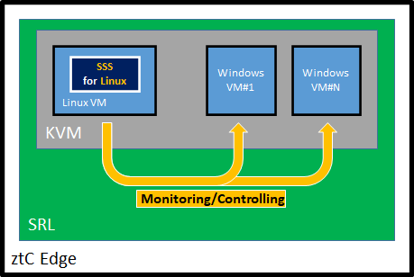
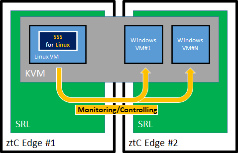

# Protecting VMs on ztC Edge by EXPRESSCLUSTER X SingleServerSafe

This text guides step by step to protect VMs on *Stratus ztC Edge* by EXPRESSCLUSTER X SingleServerSafe.

## Solution overview

Single configuration  


Fault-Tolerant configuration  


In either configuration, the role of SSS is to monitor the application running on VMs and restart the VM on abnormal detection.
DBMS (MS SQL) and HTTPD (IIS) are used in the validation.

### Configuration of SRL (Stratus Redundant Linux)

| Parameter         | Value             |
|:--                |:--                |
| IP address/Mask   | 192.168.2.90/24   |

### Configuration of SSS VM

| Virtual HW    | Number, Amount    |
|:--            |:--                |
| vCPU          | 1 CPU             |
| Memory        | 2 GB              |
| vNIC          | 1 port            |
| vHDD          | 20 GB             |

| Parameter         | Value             |
|---                |---                |
| Hostname          | sss               |
| root password     | PASSWORD          |
| IP Address/Mask   | 192.168.2.10/24   |

### Configuration of the VMs to be protected

| Parameter             | Value             |
|---                    |---                |
| VM1 IP Address/Mask   | 192.168.2.11/24   |
| VM2 IP Address/Mask   | 192.168.2.12/24   |
| VM3 IP Address/Mask   | 192.168.2.13/24   |

## Preparing medias and licenses

On the Windows client PC, prepare followings.

- [ECX SSS 5.0 for Linux](https://www.nec.com/en/global/prod/expresscluster/en/trial/zip/ecxsss50l_x64.zip) and license file.

- [AlmaLinux 8.6 x86_64](https://mirrors.almalinux.org/isos/x86_64/8.6.html) ISO

- Windows Server (2022 was used for the validation) ISO

- Microsoft SQL Server (2022 was used for the validation) and SQL Server Management Studio installation packages

Open ztC Edge console, go to `Virtual CDs`

- `Create VCD` > input `AlmaLinux8.6` as `VCD Name`, `Upload ISO file`, `Browse` > select AlimLinux ISO file > `Finish`

- `Create VCD` > input `Win2022` as `VCD Name`, `Upload ISO file`, `Browse` > select Windows Server ISO file > `Finish`

## Building VMs to be protected

Create Windows VMs which have SQL Server, IIS or an application to be monitored.

Go to `Virtual Machines` > `Create`: configure the VM. Following spec is minimum configuration for Windows Server 2022 VM.

- 1 vCPU
- 4096 MB Virtual Memory
- 32 GB Volume
- VCD : Win2022

### Installing and configuring MS SQL Server to be monitored by SSS via ODBC

----
**[NOTE]**  
In the validation, following procedure uses `ecdemo` as the DB name, `sa` and `PASSWORD` as the Mixed mode authentication.
Appropriate parameters are specified by the application or by the user in production system.

----

On the Windows VM having SQL Server to be protected,
install [MS SQL Server][7]. (Following settings are used in the validation.)
- Named Instance
- Mixed mode authentication with `sa`:`PASSWORD`

Install [SQL Server Management Studio][6] for [creating a database][4] `ecdemo` to be monitored.

Configure SQL Server to listen accesses via ODBC.

1. Open `Sql Server Configuration Manager`
2. Click `SQL Server Network Configuration`
3. Click `Protocols for [INSTANCE_NAME]`
4. Open the properties of `TCP/IP`
5. Make `Enabled` and `Listen ALL` to `Yes`
6. Click `IP Addresses` tab
7. Go to `IPAll` and set `TCP Port` to `1433`

Open `cmd.exe`. Configure the Windows firewall to open the port for accessing via ODBC.
```bat
netsh firewall set portopening protocol = TCP port = 1433 name = SQLPort mode = ENABLE scope = SUBNET profile = CURRENT
```

Open `services.msc` > restart SQL Server service e.g. `SQL Server (SQLEXPRESS)` 

## Building SSS VM

Go to `Virtual Machines` > `Create`: configure the VM with the following specs.

- 1 vCPU
- 2048 MB Virtual Memory
- 20 GB Volume
- VCD : AlmaLinux8.6

### Installing AlmaLinux

Boot the SSS VM.

Select `Minimal install` at `SOFTWARE SELECTION` during installation.

After installation, reboot the VM, login to the console of the VM as root user.
Configure host name, IP address, then configure SSH remote access to ztC Edge host.

----
**[NOTE]**  SSS VM needs to be IP reachable with Windows VMs to be protected and ztC Edge host.

----

```sh
# IP address of SSS VM
IPsss=192.168.2.10

hostnamectl set-hostname sss
nmcli c m ens3f0 ipv4.method manual ipv4.addresses $IPsss/24 connection.autoconnect yes
```

----
**[NOTE]**  Confirm if the ztC Edge host is possible to be login from SSS VM with root user.
At the first time of the login, it requires changing the password.

Log in to ztC Edge Host console with `ssh`. Then follow changing root password like following.
```sh
> IPztc=192.168.2.90
> ssh root@$IPztc
Password:KeepRunning

Password must be changed on first login.
:
New password:
```
----


```sh
# IP address of ztC Edge host
IPztc=192.168.2.90

# Make ssh key files. Note not to set password on the key.
yes no | ssh-keygen -t rsa -f /root/.ssh/id_rsa -N ""

# Make ssh access from SSS VM to ztC Edge without password.
ssh-copy-id $IPztc
```

```sh
# Disable selinux
sed -i -e 's/^SELINUX=.*/SELINUX=disabled/' /etc/selinux/config

# reboot is required for disabling selinux take effect.
reboot
```

### Installing SSS

On the Windows client PC, open `cmd.exe` and issue the followings

----
**[Note]**  The following assumes the filename of the license files.

----

```bat
REM Specifying IP address of SSS VM.
set IP=192.168.2.10

REM Copying SSS install package and licenses (Base, Alert Service and Agents) to SSS VM.
scp .\expressclssss-5.0.2-1.x86_64.rpm root@%IP%:/tmp
scp .\XSSS5.x-lin1.key root@%IP%:/tmp
scp .\ECX5.x-AltSvc-lin1.key root@%IP%:/tmp
scp .\ECX5.x-DBagent-lin1.key root@%IP%:/tmp
scp .\ECX5.x-ISagent-lin1.key root@%IP%:/tmp

REM Login to SSS VM
ssh root@%IP%
```

On the Windows client PC, open ztC Edge Console > `Virtual Machines` > Select `sss` VM > `CD Drivers & USB Devices` tab > Select `AlmaLinux8.6` > `Insert a CD`

Login to SSS VM. Issue the followings that preparing installation form DVD, installing packages and licenses, configuring firewall and SELinux.

```sh
mount /dev/sr0 /mnt
cat << EOF > /etc/yum.repos.d/almalinux-media.repo
[media]
name=media
baseurl=file:///mnt/BaseOS
enabled=1
gpgcheck=1
gpgkey=file:///etc/pki/rpm-gpg/RPM-GPG-KEY-AlmaLinux

[media1]
name=media1
baseurl=file:///mnt/AppStream
enabled=1
gpgcheck=1
gpgkey=file:///etc/pki/rpm-gpg/RPM-GPG-KEY-AlmaLinux
EOF

# Installing required packages and SSS
yum install -y --disablerepo=* --enablerepo=media* tar unixODBC
rpm -ivh /tmp/expressclssss*

# Installing license of SSS BASE and optional products
clplcnsc -i /tmp/XSSS*
clplcnsc -i /tmp/ECX5*

# Configuring firewall allowing SSS to communicate with outer world.
clpfwctrl.sh --add

# reboot to start SSS
reboot
```

# Configuring SSS to protect VMs

Add a Failover-Group named `VMs`

1. Open SSS WebUI (e.g. http://192.168.2.10:29003) and go to `Config Mode`.
2. `Add group` at the right side of `Groups`
3. Set `VMs` as `Name` > `Next` > `Next` > `Next` > `Finish`

## Configuring `Exec resource` for start/stop a VM

----
**[NOTE]**  `Exec resource` is required per VM to be protected.

----

1. Open SSS WebUI and go to `Config Mode`.
2. `Add resource` at the right side of `VMs`
3. Select `EXEC resource` as `Type` > set `exec-[VMNAME]` as [Name] e.g. `exec-VM1`> `Next`
4. `Next`
5. Select `Stop the cluster service and reboot OS` as `Final Action` for `Recovery Operation at Deactivation Failure Detection` > `Next`
6. Select `start.sh` > `Edit` as following sample > [OK]

    ```sh
    #!/bin/sh

    #------------
    # Parameters
    #

    # IP address of ztC Edge
    IP=192.168.2.10

    # VM name to be protected
    VM=WinVM1

    #------------

    echo "[I] starting [$VM]"
    ssh $IP avcli vm-poweron $VM
    if [ $? -ne 0 ]; then
            echo "[E] failed to start [$VM]"
            exit 1
    fi
    for (( i=0; i<10; i++ )); do
            sleep $(( 10 * (i + 1) ))
            state=`ssh $IP avcli vm-info $VM | grep "  -> state              :" | sed 's/^.*: //'`
            echo "[I] state = [$state]"
            if [ $state = "running" ]; then
                    exit 0
            fi
    done
    exit 1
    ```

7. Select `stop.sh` > `Edit` just same like start.sh > [OK]

    ```sh
    #!/bin/sh

    #------------
    # Parameters
    #

    # IP address of ztC Edge
    IP=192.168.2.10

    # VM name to be protected
    VM=WinVM1

    #------------

    echo "[I] stopping [$VM]"
    ssh $IP avcli vm-shutdown $VM
    if [ $? -ne 0 ]; then
            echo "[E] failed to stop [$VM]"
    fi
    for (( i=0; i<10; i++ )); do
            sleep $(( 10 * (i + 1) ))
            state=`ssh $IP avcli vm-info $VM | grep "  -> state              :" | sed 's/^.*: //'`
            echo "[I] state = [$state]"
            if [ $state = "stopped" ]; then
                    exit 0
            fi
    done
    exit 1
    ```

8. `Tuning` > `Maintenance` tab > input `/opt/nec/clusterpro/log/exec-[VMNAME].log` as `Log Output Path` > check `Rotate Log` > `OK`
9. `Finish`
10. `Apply the configuration File`

<!--
## Configuring `Custom monitor resource` for monitoring a VM
-->

## Protecting a VM with MS SQL Server - Configuring `ODBC monitor resource`

On the SSS VM, install [Microsoft ODBC driver for SQL Server][1]. Then configure DSN (Data Source Name).

----
**[NOTE]**  In the validation, the following script uses `ecdemo` as the target DB name, `sa` and `PASSWORD` for the authentication, `192.168.2.11` as IP address of the server where SQL Server installed.
Use appropriate target DB name, account, IP address to be monitored in case of the production system.

----

```sh
# Installing MS ODBC
rpm -ivh msodbcsql18-18.1.2.1-1.x86_64.rpm
```

```sh
# Making DSN template file

# IP address of Windows VM having SQL Server
IPMSSQL=192.168.2.11
cat << EOF > ./dsn.template
[ecdemo]
Driver = ODBC Driver 18 for SQL Server
Description = ECX test database
Trace = No
Encrypt = No
TrustServerCertificate = No
Server = $IPMSSQL
Database = ecdemo
EOF

# Installing (system) DSN
odbcinst -i -s -f dsn.template 

# Confirming DSN installed
odbcinst -q -s

# Confirming the access to the database by
# isql -v [Data Source Name] [User ID] [Password]
isql -v ecdemo sa PASSWORD
```
```SQL
SQL> select @@version
SQL> quit
```

On the SSS WebUI,
configure ODBC Monitor resource

1. Open SSS WebUI and go to `Config Mode`.
2. `Add monitor resource` at the right side of `Monitors`
3. Select `ODBC monitor` as `Type` > set `odbcw-[VMNAME]` as [Name] e.g. `odbcw-VM1`> `Next`
4. Set `60`sec as `Timeout` > Set `1` time as `Retry Count` > `Browse` > select `exec-[VMNAME]` > `OK` > `Next`
5. Set `ecdemo` as `Data Source Name` > Set `sa` as `User Name` > `Change` > Set `PASSWORD` as `New Password` and `Password Confirmation` > `OK` >  `Next`  

    ----
    **[NOTE]**  Above are the parameters at the validation. Set the appropriate parameters in case of the production system.

    ----
6. Select `Restart the recovery target` as `Recovery Action` > `Browse` > select `exec-[VMNAME]` > `OK` > `Finish`
7. `Apply the Configuration File`


## Protecting a VM with IIS - Configuring `HTTP monitor resource`

----
**[NOTE]**  Prepare a Windows VM having IIS beforehand. 

----

1. Open SSS WebUI and go to `Config Mode`.
2. `Add monitor resource` at the right side of `Monitors`
3. Select `HTTP monitor` as `Type` > set `httpw-[VMNAME]` as [Name] e.g. `httpw-VM1`> `Next`
4. `Browse` > select `exec-[VMNAME]` > `OK` > `Next`
5. Set the IP address of the VM having IIS as `Connecting Destination` e.g. `192.168.90.11` >  `Next`

6. Select `Restart the recovery target` as `Recovery Action` > `Browse` > select `exec-[VMNAME]` > `OK` > `Finish`
7. `Apply the Configuration File`

## Test
- VM
    1. Power off a VM to be monitored.
    2. Confirm error detection and boot of the VM by the monitor resource
- DBMS
    1. Stop SQL Server service for simulating a failure.
    2. Confirm timeout detection and reboot of the VM by the monitor resource.
- HTTPD
    1. Stop `World Wide Web Publishing Service` (IIS) for simulating a failure.
    2. Confirm timeout detection and reboot of the VM by the monitor resource.

## Operation

Configure SSS VM to be started/stopped on starting/stopping ztC Edge. SSS VM starts/stops the protected VMs with its Exec resources.

### Start VMs

Protected VMs may be configured starting automatically by ztC Edge. In the case, SSS treats protected VMs as if these are successfully started.

### Stop VMs

If a protected VM is stopped, SSS treats it as a failure and boots the VM by the recovery process. Therefore, note that on intentional stop of a VM :

- To stop a protected VM by ECX WebUI.
  1. On ECX WebUI, stop the exec resource for the VM.

- To stop a protected VM by ztC Edge console.
  1. On ECX WebUI, suspend the monitor resource for the VM.
  2. On ztC Edge console, stop the VM.

## References

[everRun Command Line Interface Reference](https://everrundoc.stratus.com/7.9.2.0/en-us/Default.htm?_ga=2.229234200.525908631.1667277272-2020070607.1616713667#Help/P02_Support/C02_CLI/N_eesCLIReference.htm?TocPath=Supporting%2520Documents%257CeverRun%2520Command%2520Line%2520Interface%2520Reference%257C_____0)

[ztC Edge User's Guide](https://ztcedgedoc.stratus.com/2.3.2.0/en-us/Default.htm#Help/P01_Users/N_eesUsersGuide.htm?TocPath=ztC%2520Edge%2520User's%2520Guide%257C_____0)

<!-- REFFERENCES -->

[1]:https://learn.microsoft.com/en-us/sql/connect/odbc/download-odbc-driver-for-sql-server?view=sql-server-ver16

[2]:https://learn.microsoft.com/en-us/sql/connect/odbc/linux-mac/installing-the-microsoft-odbc-driver-for-sql-server?view=sql-server-ver16#redhat18

[3]:https://qiita.com/arachan@github/items/5863c945dbe7507975d8

[4]:https://sqlserver.programmer-reference.com/sqlserver-use-sqlcmd/

[5]:https://setsuna-no-matataki.hateblo.jp/entry/2020/02/02/165837

[6]:https://learn.microsoft.com/en-us/sql/ssms/download-sql-server-management-studio-ssms?view=sql-server-ver16

[7]:https://www.microsoft.com/en-us/sql-server/sql-server-downloads
